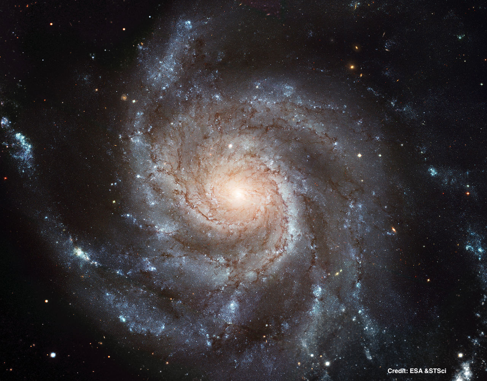
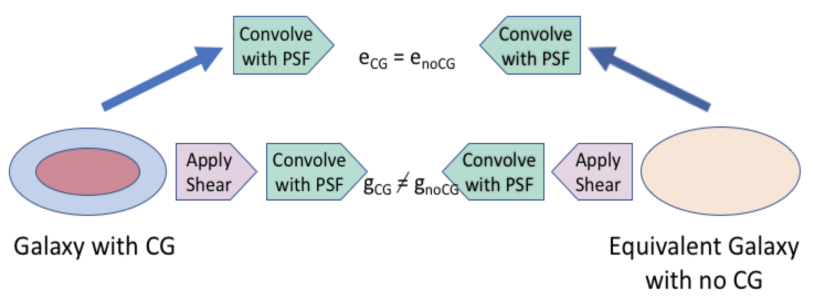
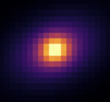
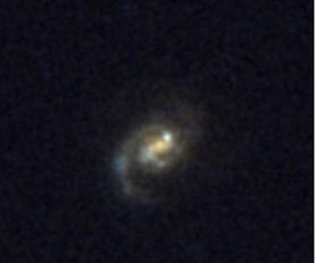
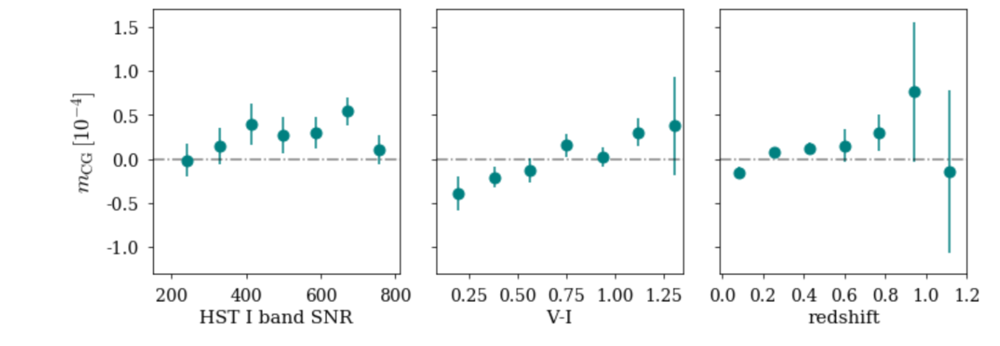
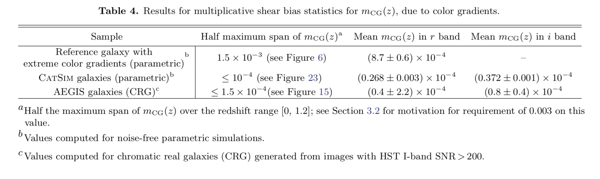

# measure_cg_bias
This repository contains script to estimate bias on weak lensing (WL) measurements
with the Large Synoptic Survey Telescope (LSST) from galaxy color gradients. For a more in-depth understanding,
refer to this [document](https://www.overleaf.com/read/btzzycnnrfzs) describing
measurement techniques and results in detail.

[notebooks](https://github.com/sowmyakth/measure_cg_bias/tree/master/notebooks)
has jupyter notebooks with plots showing the galaxies and PSF for
analysis as well as the results.

[data](https://github.com/sowmyakth/measure_cg_bias/tree/master/data)
contains template SEDs, LSST filter response curves, and HST noise
correlation functions used in the analysis.

## What are galaxy color gradients?
Galaxies usually do not have a uniform spectral energy densities (intensity at each wavelength)
across it's spatial profile. Galaxy color gradients denote that the galaxy has
different colors in different places, as can be seen by this image of
the Pinwheel galaxy (M101).

## Why is there a bias?
Weak lensing measurements involve estimating the correlations in the distortions
of galaxy shapes due to gravitational lensing from matter along the line of sight. From this we can infer mass
distribution between the galaxies and us. However, the observing telescope and
the atmosphere can introduce distortions too. We clump these effects here as
the point spread function (PSF). These PSF distortions are color dependent and thus their effect will be
different across the galaxy due to color gradients. If this effect is incorrectly
corrected then the estimated shapes and thus WL signal (shear measurements) can
be biased.

## How do we estimate CG bias?
Several different systematics can bias shear estimates. Thus, to isolate bias from
color gradientss (CG) only we compare the shear measured from a galaxy with color gradients to an
equivalent galaxy with no color gradients. Impact from all systematics other than
CG will be the same for the two galaxies, thereby giving an estimate of bias from
CG only.

## What is the dataset?
CG bias is estimated for three types of galaxy images:
1. Reference parametric galaxy with bulge and disk: Since most galaxies important
for WL measurements are well approximated by elliptical Sersic bulge + disk profiles,
we simulate galaxies with no noise like this

The reference galaxy has extreme color gradients and are not representative of all galaxies LSST
will see. We use this galaxy to place limits on the extent of CG bias.

2. Galaxies from CatSim (Catalog Simulator) with a range of color gradients that
could be observed with LSST. These galaxies are parametric bulge + disk models with galaxy size and color
distribution that LSST will be expected to see.  
3. HST V/I band images from AEGIS survey are redrawn as would be seen by LSST. These
are real galaxy images with noise.

The download-able AEGIS [catalog](http://great3.jb.man.ac.uk/leaderboard/data/public/AEGIS_training_sample.tar.gz)
contains postage stamp images of isolated galaxies and photometric measurements
in V/I bands. Detailed document describing how the catalog was created
can be found [here](https://docs.google.com/viewer?url=https://github.com/sowmyakth/measure_cg_bias/raw/master/pdfs/Reducing_AEGIS_gal.pdf)

## How big is the bias?
For noise-free parametric galaxy simulations, the value of half the maximum span of mCG(z) in the redshift range [0, 1.2] is < 1.5 x 10-3 for the reference galaxies with extreme color gradients and < 10-4 CatSim galaxies. For input AEGIS galaxies with pixel noise, the estimated bias shows a strong dependence on SNR due to contributions from effects other than CG.However, for AEGIS galaxies with HST I-band SNR > 200, the magnitude of the mean estimated bias is <0.0009, while the value of half the maximum span of mCG(z) is < 1.5 x 10-4. 
Therefore, for both the noise-free parametric galaxies and for the AEGIS galaxies with SNR > 200, the half-maximum span is less than the LSST full-depth requirement of 0.003 on the total systematic uncertainty in the redshift-dependent shear calibration mz(z). 

  
The values of CG bias are summarized in the table below. Refer this [document](https://www.overleaf.com/read/btzzycnnrfzs) explaining the results in detail.

