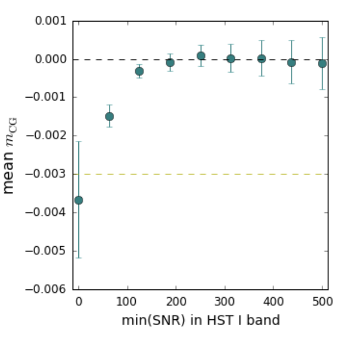

# measure_cg_bias
This repository contains script to estimate bias from galaxy color gradients on WL measurements
with the Large Synoptic Survey Telescope (LSST). For a more in-depth understanding,
refer to this [document](https://www.overleaf.com/read/wqztwvtnxhvn) describing
measurement techniques and results in detail.

[notebooks](https://github.com/sowmyakth/measure_cg_bias/tree/master/notebooks)
has jupyter notebooks with plots showing the galaxies and PSF for
analysis as well as the results.

[data](https://github.com/sowmyakth/measure_cg_bias/tree/master/data)
contains template SEDs, LSST filter response curves, and HST noise
correlation functions used in the analysis.

## What are galaxy color gradients?
Galaxies usually do not have a uniform spectral energy densities (intensity at each wavelength)
across it's spatial profile. Galaxy color gradients denote that the galaxy has
different colors in different places, as can be seen by this image of
the Pinwheel galaxy (M101).

## Why is there a bias?
Weal lensing measurements involve estimating the correlations in the distortions
of galaxy shapes due to gravitational lensing. From this we can infer mass
distribution between the galaxies and us. However the observing telescope and
the atmosphere can introduce distortions too. We clump these effects here as
the PSF. These PSF distortions are color dependent and thus their effect will be
different across the galaxy due to color gradients. If this effect is incorrectly
corrected then the estimated shapes and thus WL signal (shear measurements) can
be biased.

## How do we estimate CG bias?
Several different systematics can bias shear estimates. Thus to isolate bias from
CG only we compare the shear measured from a galaxy with color gradients to an
equivalent galaxy with no color gradients. Impact from all systematics other than
CG will be the same for the two galaxies, thereby giving an estimate of bias from
CG only.

## What is the dataset?
CG bias is estimated for three types of galaxy simulations:
1. Reference parametric galaxy with bulge and disk: Since most galaxies important
for WL measurements are well approximated by elliptical Sersic bulge + disk profiles,
we simulate galaxies with no noise like this

2. Galaxies from CatSim (Catalog Simulator) with a range of color gradients that
could be observed with LSST.
3. HST V/I band images from AEGIS survey are redrawn as would be seen by LSST. These
are real galaxy images with noise.

The download-able AEGIS [catalog](http://great3.jb.man.ac.uk/leaderboard/data/public/AEGIS_training_sample.tar.gz)
contains postage stamp images of isolated galaxies and photometric measurements
in V/I bands. Detailed document describing how the catalog was created
can be found [here](https://docs.google.com/viewer?url=https://github.com/sowmyakth/measure_cg_bias/raw/master/pdfs/Reducing_AEGIS_gal.pdf)

## How big is the bias?
The bias estimated from the noise-free parametric galaxy simulations are all lower
than the LSST requirements on shear bias. However the bias from noisy galaxy images
shows a strong dependence on the signal-to noise ratio or SNR of the galaxy.
The magnitude of mean CG bias $<0.0009$, based on AEGIS galaxies with SNR $> 100$
is lower than the LSST requirement of 0.003.

